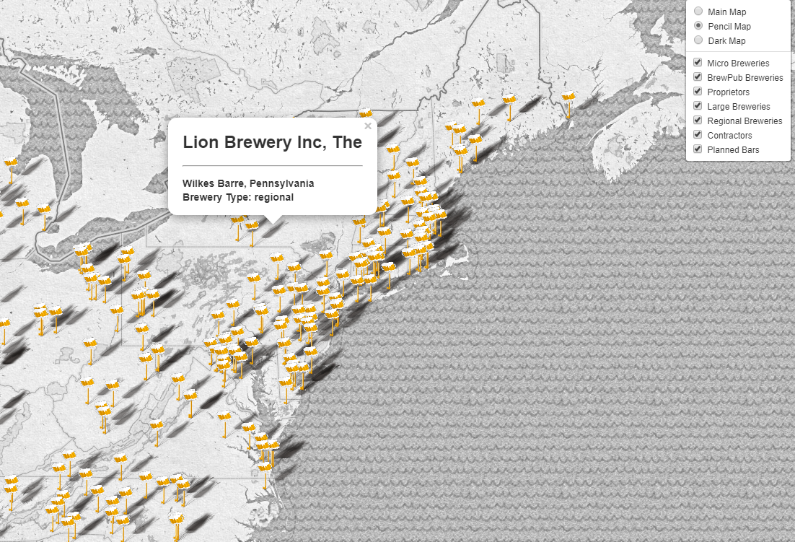
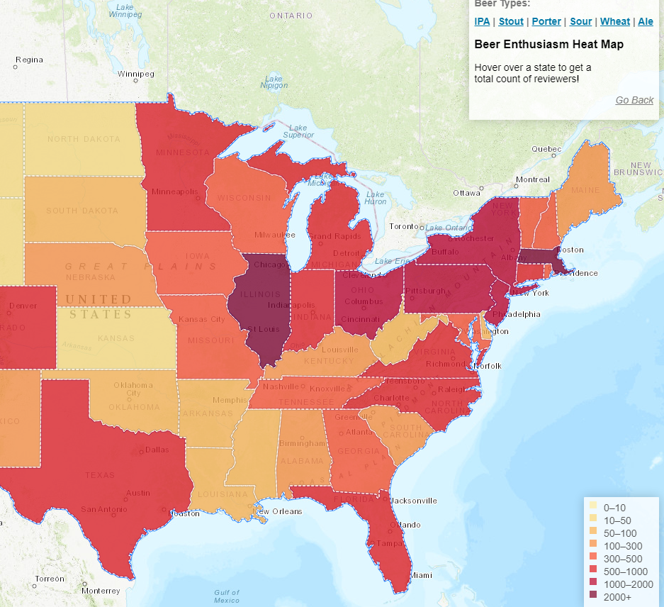
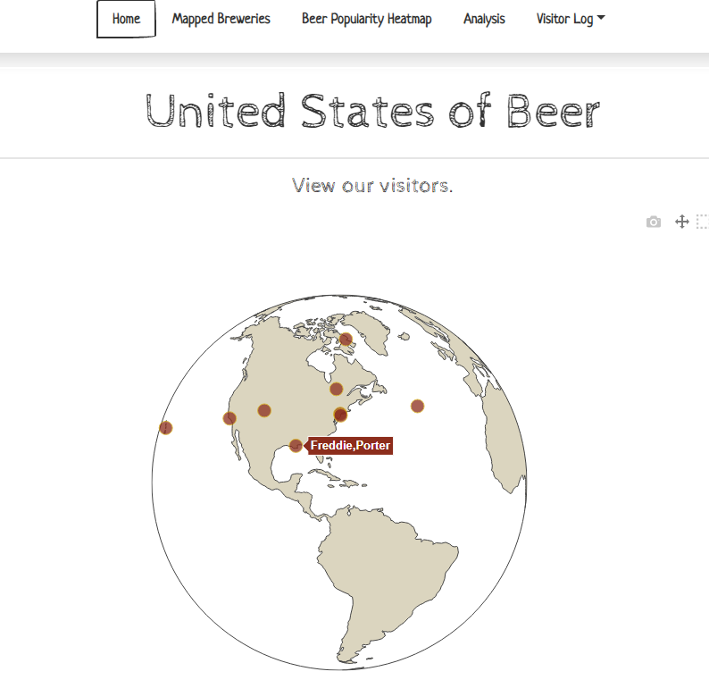

# United States of Beer
## Final Project, Group 6

* We were interested in exploring craft beer in the USA, which proved to be a difficult feat! In the process of exploration we discovered expensive pay walls and restricted and shallow datasets, but we found solutions and dove into mapping and analysis despite it all.

### Github Participants:
* @jkim6367 - Jeff Kim 
* @christos-f - Christos Ferderigos
* @jjjjjeb - Jamie Bruno

## Project:
Initial Questions:
* Which states have the most craft breweries?
* Can we discover state or regional beer preferences?
* Which beer styles are the most popular throughout the USA?
* Can we use ML to determine beer enthusiast purchasing habits by state to inform marketing strategy?

## Data Sources:
Process: 
* ~~NAICS Data → PAYWALL~~
* ~~Brewers Association → MEMBERSHIP ONLY PAYWALL~~
* [Open Brewery DB (Rapid API)](https://rapidapi.com/brianiswu/api/open-brewery-db)
* [BeerAdvocate.com](https://www.beeradvocate.com/) → Scrapped Data, ETL
* [US Census Data](https://www.kaggle.com/muonneutrino/us-census-demographic-data#acs2017_county_data.csv) via Kaggle

## Summary: 
We scrapped information on the top 250 beers most reviewed beers on BeerAdvocate.com as our main dataset. This dataset was cleaned and normalized for input into a Postgres DB. The dataset was then plotted on a cloropleth map showing the number for beer reviews per state and beer style.  In addition to the cloropleth map we used a sample of static data parsed from an API call to plot brewery types through the United States. We then used machine learning tools to elicit findings on our beer advocate dataset.

We created a web app to display our work and findings, and lastly added interactive functionality through a visitor log and map. 

We worked in Javascript, SQL, Python, HTML, and CSS. We used Pandas, Splinter, Bootstrap, Leaflet, Plotly, d3, Flask, SQL Alchemy, MatplotLib, SciKitLearn, LabelEncoder, OneHotEncoder, KMeans, Apriori, Heirarchical/Agglomerative Clustering, and many more modules to bring this project together.

## Analysis
Our analysis primarily utilizes Machine Learning via SciKitLearn and plotting with MatplotLib to analyze beer style, location by state, and users. We decided to focus on state and style data because user demographic data was limited to gender, which was self-restricting as a quick analysis of user reviews lead to the discovery that out of 4807 reviews 0.42% were female, 90.01% were male, and 9.57% were listed as 'unspecified'.

The ML method that proved the most successful for us was APRIORI.  This method allowed us to discover state similarities by review count. The below rules show how likely it is for a beer that's reviewed in one state to be reviewed in the following state  Confidence scale is between 0-1. 

### Rule: Minnesota -> New Jersey
* Support: 0.5933609958506224
* Confidence: 0.8511904761904763                   
* Lift: 1.206687675070028                              

### Rule: Minnesota -> New Jersey                    
* Support: 0.5933609958506224                      
* Confidence: 0.8511904761904763
* Lift: 1.213827838827839                    

### Rule: New Jersey -> Connecticut
* *Support: 0.5560165975103735
* Confidence: 0.8481012658227849
* Lift: 1.2094225151674034

### Rule: New Jersey -> Connecticut
* Support: 0.5560165975103735
* Confidence: 0.8427672955974843
* Lift: 1.2018160842544008

### Rule: New Jersey -> Connecticut
* Support: 0.5518672199170125
* Confidence: 0.8109756097560976
* Lift: 1.213944856839873

### Rule: New Jersey -> Connecticut
* Support: 0.5767634854771784
* Confidence: 0.8224852071005917
* Lift: 1.201326878249955

## Screenshots from the app

